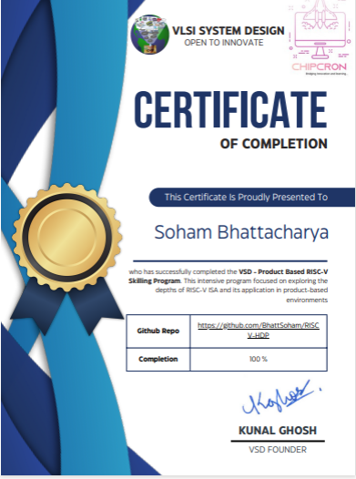

# RISCV-HARDWARE DESIGN PROGRAM (https://www.vlsisystemdesign.com/hdp_riscv/) #
**Product-Based RISC-V Skilling Program**

***1. Exploring RISC-V's history, architecture, and Verilog simulations.***

***2. Unlocking processor functionalities with hands-on exercises.***

***3. Delving into Verilog code analysis and advanced instructions.***

***4. Mastering I/Os with practical, real-world implementations.***

***5. Enhancing programming with C code and inline assembly.***

***6. Learning testbench strategies and functional simulation techniques.***

## Course Curriculum: ##

***The weekly course curriculum includes the following:***

### Week 0: ### 
1. Install **Oracle Virtual VM Machine** via **VDI**.
2. Create a **GitHub** repository to share your work with others.

### Check the directory (week_0) for more details! ###

### Week 1: ###
1. Execute **C** code for ***hello world***, ***counters***, and ***matrix multiplication*** with **Assembly differences**.
2. Focus on **binary arithmetic**.
3. Create an ***adder*** with **C** and **Verilog** code, utilizing **Iverilog** and **gtkwave**. Run the same program on **Godbolt** to create assembly instructions.
4. Create a ***4-bit arithmetic logic unit (ALU)*** with C and Verilog code, utilizing **Iverilog** and **GTKWAVE**. Run the same program on **Godbolt** to create assembly instructions.

### Check the directory (week1) for more details! ###

### Week 2: ###
1. **RISC-V-based MYTH workshop:**
   
    i. Introduction to **RISC-V ISA** and **GNU compiler** toolchain.
   
    ii. Introduction to **ABI** and basic verification flow.
   
3. Measurement of **CPU performance metrics**.
4. Basic **RISC-V Microarchitecture** Implementation.
5. Verify all the previous C codes in Week 1 and Week 2 using **RISC-V compiler** and **SPIKE ISA simulator**.
6. CPU performance calculation of the assembly codes with those C programs using the **RISC-V Disassembler**.

### Check the directory (week2) for more details!  ###

### Week 3 and Week 4: ###
**PROJECT: "Obstacle Awareness for Individuals with Disabilities"**
1. An overview of the project.
2. Key Components for designing the project.
3. An outline of the project using a **block diagram**.
4. Basic **C** code compilation using **GCC** compiler and **RISC-V compiler**.
5. Simulating the code using **SPIKE ISA simulator**.
6. Assembly code generation for the basic **C** code.
7. **Inline assembly code** for the Obstacle detector.
8. Testing the code with **SPIKE ISA Simulator** and Assembly code generation using **RISC-V objdump** command.

### Check the directory (week3) for more details! ###

### Week 5: ###
   1. Updating the ***.json*** file and generating the **RTL design** using the **Chipcron Tool**.
   2. **GPIO Configuration** and **Functional Simulation** using **UART**.
   3. Simulating it with the help of **Icarus Verilog** simulator.
   4. Waveform generation using the **GTKWAVE**.

### Check the directory (week5) for more details! ###

### Week 6: ###
   1. Bypassing the **UART**.
   2. **Gate-level synthesis** using the open-source **Yosys** synthesizing tool.
   3. **Gate-level Simulation** using **Skywater 130nm PDK**.
   4. Waveform generation using the **GTKWAVE**.

### Check the directory (week6) for more details! ###

This course gave participants a comprehensive grasp of creating RISC-V-based embedded projects, covering everything from application code to Netlist. As part of the course curriculum, I got to use the Chipcron tool offered by RISC-V startup https://chipcron-pvt-ltd.github.io/webpage/, to generate a customized RISC-V core. Furthermore, by simulating application code on the created core, I was able to have hands-on experience and improve my understanding of RISC-V architecture and design techniques.

