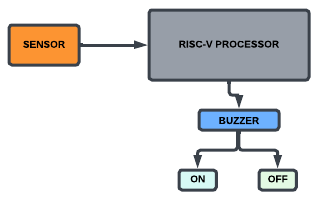

# ANTI-THEFT DETECTION AT HOME #

This section will provide all the necessary details to focus on building an anti-theft detection system at home.

## PROJECT OVERVIEW ##

The Anti-Theft Compartment project is a comprehensive safety or security solution designed to safeguard valuable assets from unauthorized access. This innovative project integrates both hardware and software elements. Beyond its primary function of enhancing security, this project offers a valuable opportunity to delve into the intricacies of implementing the RISC-V Instruction Set Architecture (ISA) for Application-Specific Integrated Circuit (ASIC) development.

## KEY COMPONENTS ##

1. SENSOR DETECTOR: The project consists of a sensor, which will detect if there's any unauthorized access happens in the room.

2. RISC-V PROCESSOR: The processor that will handle all the necessary instructions customized for designing this project.

3. BUZZER: The buzzer will help to detect with its controllable 'On' and 'OFF' switches to detect the access.

## BLOCK DIAGRAM #

